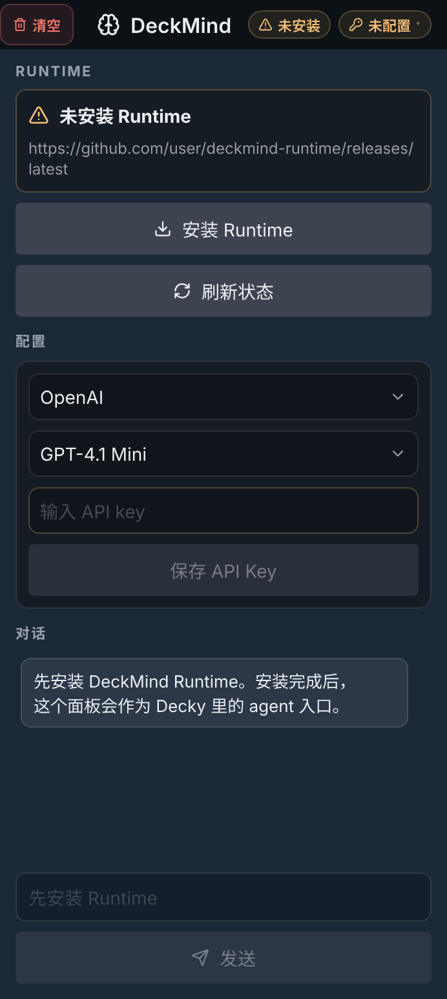
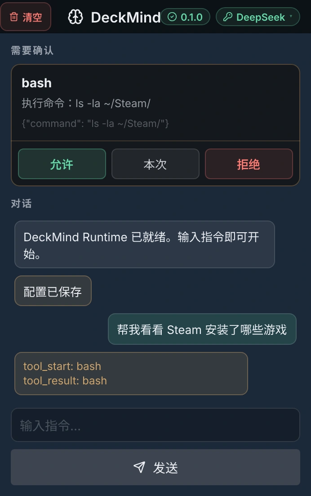

# steamdeck-agent

> [Chinese README](README.zh-CN.md)

A minimal, framework-free LLM **agent runtime** for Linux / Steam Deck.
Built to be small enough to read in one sitting — the whole loop is in
[`runtime/agent.py`](runtime/agent.py).

## Architecture

```
            ┌─────────────────────────────────────────────┐
            │                  Agent.handle()             │
            │                                             │
  user ──▶  │  Planner ──function_call──▶ Executor ──▶ tool │
            │     ▲                            │           │
            │     └──function_call_output──────┘           │
            │       (loop until the model emits text)      │
            └─────────────────────────────────────────────┘
```

- **Planner** (`runtime/planner.py`) — one call to the configured LLM
  provider. Returns the next `function_call` the model wants to make.
- **Executor** (`runtime/executor.py`) — looks the tool up in the
  registry and awaits it.
- **Agent** (`runtime/agent.py`) — the runtime loop that wires them
  together, feeds tool results back, and stops when the model emits
  natural-language text or after `MAX_STEPS` iterations.
- **Tools** (`tools/*.py`) — actual side-effecting code (Steam, system,
  macros). Add one by registering it in `tools/__init__.py`.
- **Memory** (`memory/session.py`) — bounded chat history.

For a more detailed visual architecture diagram, open
[docs/architecture.html](docs/architecture.html) in a browser.

## Install (any Linux / macOS dev machine)

Requires Python 3.11+.

```bash
git clone https://github.com/Hurtblack/DeckMind.git
cd DeckMind
./install.sh                 # installs uv + deps, sets up `deckmind` cmd,
                             # asks for your LLM API key (input hidden)
```

Open a new terminal and run `deckmind`. The installer is idempotent —
re-run any time. If you'd rather do every step manually, see the
Steam Deck instructions below.

## Install on a Steam Deck

> ⚠️ Install in **Desktop Mode** (KDE). Once it works, add it as a
> non-Steam game so you can launch it from Game Mode too.

**TL;DR fast path:** in Konsole, run:

```bash
passwd                                                          # one-time, set a sudo password
cd ~ && git clone https://github.com/Hurtblack/DeckMind.git
cd ~/DeckMind && ./install.sh                                   # everything else
```

Open a new Konsole window, type `deckmind`, done. The manual step-by-step
below explains what `install.sh` actually does.

### 1. Switch to Desktop Mode

Power button → **Switch to Desktop**.

### 2. Set a sudo password (first time only)

Open **Konsole** (Application menu → System → Konsole):

```bash
passwd
```

SteamOS ships with no sudo password — you must set one before installing
anything system-wide.

### 3. Install uv

```bash
curl -LsSf https://astral.sh/uv/install.sh | sh
source $HOME/.local/bin/env
```

uv installs into `~/.local/bin`, which survives SteamOS read-only `/usr`
updates. If a major SteamOS update wipes it, rerun this command.

### 4. Get the project onto the Deck

Pick one:

```bash
# A. Clone from GitHub
cd ~ && git clone https://github.com/Hurtblack/DeckMind.git

# B. Copy from another machine via scp
#    (run this on your laptop, not the Deck)
scp -r DeckMind deck@<deck-ip>:/home/deck/
```

### 5. Install dependencies

```bash
cd ~/DeckMind
uv sync
```

### 6. Configure the API key (persistent)

```bash
echo 'export LLM_PROVIDER=deepseek'       >> ~/.bashrc
echo 'export DEEPSEEK_API_KEY=sk-...'     >> ~/.bashrc
source ~/.bashrc
```

(Use whichever provider you prefer — see the table below.)

### 7. Run

```bash
cd ~/DeckMind
uv run python main.py
```

Try:

```
you › Check the current battery level
you › Set the volume to 30%
you › Launch CS2
```

### 7b. (Optional) Make it a one-word command

Add a tiny shell function so you can launch from anywhere by typing
`deckmind`:

```bash
echo 'deckmind() { (cd ~/DeckMind && uv run python ./main.py "$@"); }' >> ~/.bashrc
echo 'deckmind-update() { (cd ~/DeckMind && git pull && uv sync); }'   >> ~/.bashrc
source ~/.bashrc
```

Daily use after that:

```bash
deckmind                 # start the agent
deckmind -v              # verbose / developer mode
deckmind-update          # git pull + uv sync from anywhere
```

### 8. Launch from Game Mode (add as a non-Steam game)

Game Mode has no terminal UI, but you can wrap the Agent in a launcher
script and add it to Steam as a non-Steam game. After that it shows up
in your library and you can start it from Game Mode's launcher.

**8.1 Create the launcher script**

```bash
cat > ~/DeckMind/run-agent.sh <<'EOF'
#!/bin/bash
# Launcher for SteamDeckAgent — opens a Konsole window that runs the REPL.
cd "$(dirname "$0")"

# Load API keys from ~/.bashrc so the env vars are visible to the agent.
source "$HOME/.bashrc"

# `-e` runs a command inside Konsole; the trailing `read` keeps the window
# open after the agent exits so you can see any error messages.
konsole --hold -e bash -c "uv run python main.py"
EOF

chmod +x ~/DeckMind/run-agent.sh
```

**8.2 Add it to Steam**

1. Open the Steam client (Desktop Mode).
2. Bottom-left: **Add a Game → Add a Non-Steam Game…**
3. Click **Browse**, navigate to `/home/deck/DeckMind/`, set the
   file filter to *All files*, and pick `run-agent.sh`.
4. Confirm. The entry now appears in your library as "run-agent.sh" —
   rename it to "SteamDeckAgent" (right-click → Properties).

**8.3 Use it**

- In **Desktop Mode**: double-click it in your library → a Konsole
  window opens with the REPL.
- In **Game Mode**: launch it like any game → SteamOS drops you into a
  desktop-like overlay running Konsole. Use the on-screen keyboard
  (`STEAM + X`) or a paired Bluetooth keyboard to type prompts.

> Tip: typing on the on-screen keyboard is slow. A small Bluetooth
> keyboard makes Game Mode usage actually pleasant.

### Known Steam Deck limitations

- **Macros are off by default on the Deck.** The `pynput` library that
  powers `press_key` / `start_key_loop` needs the `evdev` C extension,
  which fails to build on SteamOS (no kernel headers — the `/usr` tree
  is immutable). Even if it did install, pynput cannot inject keys into
  Wayland sessions (KDE Plasma in Desktop Mode, Gamescope in Game Mode),
  so it'd be a no-op anyway. With pynput absent, macro tools return a
  harmless mock result. To actually enable macros, switch the backend
  to `ydotool` — open an issue or PR; it's a small change to
  [tools/macro_tool.py](tools/macro_tool.py).
- **Steam launch** requires the `steam` client to be running. In Game Mode
  it always is; in Desktop Mode start Steam first.
- **Battery device** on the Deck is `BAT1` (not `BAT0`). The code
  auto-detects either.

## Configure — choose an LLM provider

Set `LLM_PROVIDER` to pick the backend. Each provider needs its own API key.

| Provider | `LLM_PROVIDER` | API-key env | Default model |
|---|---|---|---|
| OpenAI (Responses API) | `openai` *(default)* | `OPENAI_API_KEY` | `gpt-5.4-mini` |
| OpenAI (Chat Completions) | `openai-chat` | `OPENAI_API_KEY` | `gpt-5.4-mini` |
| Anthropic Claude | `anthropic` | `ANTHROPIC_API_KEY` | `claude-sonnet-4-6` |
| **DeepSeek** | `deepseek` | `DEEPSEEK_API_KEY` | `deepseek-v4-flash` |
| Moonshot China (Kimi) | `moonshot` | `MOONSHOT_API_KEY` | `kimi-k2.6` |
| Moonshot Global (Kimi) | `moonshot-global` | `MOONSHOT_API_KEY` | `kimi-k2.6` |
| Alibaba Qwen | `qwen` | `DASHSCOPE_API_KEY` | `qwen-plus` |

Override the model with `LLM_MODEL=...` if you don't want the default.

```bash
# Example: OpenAI (default)
export OPENAI_API_KEY=sk-...

# Example: Anthropic Claude
export LLM_PROVIDER=anthropic
export ANTHROPIC_API_KEY=sk-ant-...

# Example: DeepSeek
export LLM_PROVIDER=deepseek
export DEEPSEEK_API_KEY=sk-...
# export LLM_MODEL=deepseek-reasoner   # optional

# Example: Kimi, China endpoint
export LLM_PROVIDER=moonshot
export MOONSHOT_API_KEY=sk-...

# Example: Kimi, global endpoint
export LLM_PROVIDER=moonshot-global
export MOONSHOT_API_KEY=sk-...
```

Adding a new OpenAI-compatible provider = adding one entry to
`PROVIDERS` in [llm/__init__.py](llm/__init__.py). The Agent itself
does not change.

## Run

```bash
uv run python main.py
```

## Decky plugin panel

The `decky-plugin/` package is a Decky plugin shell for installing the
runtime and chatting with DeckMind from the Steam Deck UI.





- Provider and model selectors now cover OpenAI, OpenAI Chat, Anthropic
  Claude, DeepSeek, Moonshot China, Moonshot Global, and Qwen.
- Chat history is stored in browser `localStorage`, so closing the panel
  or restarting Steam does not immediately wipe the conversation.
- The header includes a clear-history button for resetting the panel
  conversation.
- Failure messages include a copy button, which is useful when pasting
  install or runtime errors into an issue.

For the full two-page visual preview, see
[decky-plugin/slides.pdf](decky-plugin/slides.pdf).

Build the panel bundle from `decky-plugin/`:

```bash
npm install
npm run build
```

## Built-in tools (41 total)

| Group | Tools | Risk |
|---|---|---|
| Steam | `launch_game`, `close_game`, `list_running_games` | side-effect |
| Steam | `install_game`, `uninstall_game` | **destructive (2-step confirm)** |
| Packages | `list_flatpak_apps`, `search_flatpak`, `disk_usage` | safe |
| Packages | `install_flatpak`, `uninstall_flatpak` | **destructive (2-step confirm)** |
| Pacman / SteamOS | `pacman_search`, `steamos_lock_status`, `steamos_lock` | safe |
| Pacman / SteamOS | `steamos_unlock` | side-effect |
| Pacman / SteamOS | `pacman_install`, `set_pacman_mirror_china` | **destructive (2-step confirm)** |
| System | `get_battery`, `get_volume` | safe |
| System | `set_volume` | side-effect |
| Macro | `press_key`, `start_key_loop`, `stop_all_macros` | side-effect |
| Files / diagnostics | `find_files`, `list_processes`, `read_text_file` | safe |
| Files / diagnostics | `write_text_file`, `run_command` | **destructive (2-step confirm)** |
| Decky plugin | `install_decky_plugin` | **destructive (2-step confirm)** |
| **Profile** | `remember`, `forget`, `list_profile` | safe |
| **Self-update** | `check_for_updates` | safe |
| **Self-update** | `apply_update` | **destructive (2-step confirm)** |
| **Notion** | `notion_status`, `notion_databases`, `notion_set_default_database`, `notion_pages`, `notion_recent`, `notion_total` | safe |
| **Notion** | `notion_log_session`, `notion_create_page` | side-effect |

The agent ends a turn by emitting natural-language text — there is no
`final_answer` sentinel tool.

### Runtime permission gate

The Executor (`runtime/executor.py`) enforces a permission gate **in
Python** before each tool runs — independent of, and stronger than, the
system-prompt rules. Three risk classes:

| Class | Behavior | Tools |
|---|---|---|
| `safe` | runs silently | get_*, list_*, search_*, disk_usage, find_files, list_processes, read_text_file, check_for_updates, remember/forget/list_profile, pacman_search, steamos_lock_status/lock, Notion read tools |
| `side_effect` | prompts `[y / n / a]` (a = allow this tool for the rest of the session) | set_volume, press_key, start_key_loop, stop_all_macros, launch_game, close_game, steamos_unlock, notion_log_session, notion_create_page |
| `destructive` | `confirm=false` is a free preview; `confirm=true` prompts `[y / n / a]` before running | install_*, uninstall_*, apply_update, pacman_install, set_pacman_mirror_china, write_text_file, run_command |

The gate's default is **ask, don't block** — you always have the final
word. `a` (allow-all) carries across both side-effect and destructive
prompts for the remainder of the session, so batch operations don't
pester you.

### When the agent will hard-refuse with a reason

A small set of operations would actually break the running system, so
the tools themselves refuse them outright and report why. The LLM sees
the reason and explains it back to you instead of just looking
confused.

- **`close_game`** refuses `process_name` values matching any of:
  `systemd`, `init`, `kernel`, `gamescope`, `kwin`, `plasma`, `kded`,
  `xorg`, `wayland`, `pipewire`, `pulseaudio`, `dbus`. Each comes with
  a one-line reason (e.g. "PID 1 / system init — killing this crashes
  the machine").
- **`uninstall_flatpak`** refuses app IDs that are shared runtimes
  every other Flatpak app depends on: `org.freedesktop.Platform`,
  `org.freedesktop.Sdk`, `org.kde.Platform`, `org.gnome.Platform`,
  and their `.Sdk` / `.Locale` / `.GL.*` sub-IDs. Removing one of these
  breaks every Flatpak app on the system.
- **`run_command`** never uses a shell and refuses shell syntax such as
  pipes, redirects, `&&`, command substitution, and `$` expansion. Its
  advanced mode still hard-refuses `sudo`/`su`/`doas`, shells and script
  interpreters, `pacman`, `rm`, system-level `systemctl`, `mkfs`, raw
  device writes, shutdown, and reboot.
- **`write_text_file`** writes only inside user-owned allowlisted
  directories. Sensitive paths such as `.env`, `token`, `secret`,
  `credential`, `password`, and `~/.ssh` require an explicit
  `high_risk_confirm=true` call and do not echo the file contents in
  dry-run previews. This protects the local preview/output path; if you
  paste a real token into chat, it can still be seen by the configured
  LLM provider.

Everything else — including arguably scary stuff like killing a process
named `bash`, or uninstalling a third-party emulator — just goes
through the normal prompt and lets you decide.

### Restricted command automation

`run_command` exists to remove "please type this in Konsole" friction for
small user-level workflows. It has two modes:

- **Normal allowlist**: `curl`/`wget` downloads into approved user
  directories, `tar -xzf` safe extraction, `chmod +x`, `mkdir -p`,
  `launch_file`, `file`, `which`, and simple `systemctl --user` actions.
- **Advanced mode**: commands outside the normal allowlist can run from
  trusted executable directories only, still as argv and still without a
  shell. They require a dry-run, explicit user approval, and
  `high_risk_confirm=true`.

Examples of supported automation:

```text
Download an AppImage:
run_command(["curl", "-L", "-o", "~/Downloads/App.AppImage", url])

Extract a user-space tarball:
run_command(["tar", "-xzf", "~/Downloads/app.tar.gz", "-C", "~/Downloads"])

Launch an approved executable:
run_command(["launch_file", "~/Downloads/App.AppImage"])

Advanced diagnostic:
run_command(["pgrep", "-a", "clash"], advanced=true)
```

This is not a general-purpose root terminal. For example,
`sudo npm i -g pnpm@9` is intentionally refused.

## Persistent user profile

The agent remembers facts you've told it across restarts. Stored at
`~/.deckmind/profile.json` as a flat key→value map. The profile is
auto-injected into the system prompt at every startup, so the agent
already "knows you" before the first message.

```text
you › Remember that my name is hurtblack, I like Soulslikes, and I only play on weekends.
deckmind › Got it. I saved that to your profile.

[exit, reopen, even reboot]

you › Recommend something I can play right now.
deckmind › Since you like Soulslikes and have limited time, try Sekiro for a focused session.
```

You can also hand-edit `~/.deckmind/profile.json` — it's plain JSON.

## Self-update

The agent can pull its own latest commits from GitHub:

```
you › Check for updates        -> calls check_for_updates (read-only)
deckmind › You are 3 commits behind. Recent changes: ...

you › Pull the update          -> calls apply_update(confirm=false)
deckmind › Preview: abc -> def, 3 commits. Apply it?
you › Confirm
deckmind › Updated with git pull and uv sync. Restart the agent to load the new code.
```

Safety constraints:
- Only operates inside the project directory.
- Pulls from whichever `origin` is already configured (the LLM can't
  redirect to another URL — the tool doesn't accept one).
- `git pull --ff-only`, so divergent histories fail loudly instead of
  silently merging.
- Hard-refuses when tracked files have uncommitted edits. Untracked
  files (e.g. `uv.lock`) are left alone and don't block.

## Notion logbook

Log play sessions to your Notion database. Three steps to set up:

1. **Get a token** — create an *Internal Integration* at
   https://www.notion.so/profile/integrations, copy the `ntn_…` secret.
2. **Set the env var** with `nano ~/.bashrc` (NEVER paste the token
   into the agent or any chat — it'd be leaked to the LLM provider's
   logs):
   ```bash
   export NOTION_API_KEY=ntn_xxxxx
   ```
   Then `source ~/.bashrc` and restart `deckmind`.
3. **Share a database** with the integration in Notion (database
   page → `⋯` → Connections → search "DeckMind" → add).

That's it — **no `NOTION_DATABASE_ID` needed**. When you say
"connect notion", `notion_status` auto-discovers:

- **1 shared database** → silently picks it, persisted to
  `~/.deckmind/notion.json`.
- **2+ databases** → lists them and asks which to use, then calls
  `notion_set_default_database`.
- **0 databases** → tells you to share one first.

Schema is matched by **field type**, not name — any database with at
least a Title, a Number, a Date (and optionally a Rich Text field for
notes) works.

```
you › Log that I just played Hades for 1 hour.
deckmind › Logged: Hades, 60 minutes, today.

you › How much did I play this week?
deckmind › 8.5 hours this week. Top games: Hades 4h, Stardew 2h, CS2 1.5h.
```

## What you see at runtime (UI)

```
you ›                  <- cyan, bold (your input)
deckmind ›             <- green, bold (agent reply, streamed token-by-token)
  · tool_name...       <- dim yellow (quiet mode tool indicator)
  ! refused: ...       <- dim red (only on errors/refusals)
  footer line          <- dim grey: elapsed time, turn tokens, session totals, model
```

- **Streaming**: text appears character-by-character as the model
  generates it. No more waiting for whole paragraphs.
- **Footer**: shows wall-clock seconds + this turn's tokens + lifetime
  session totals + which model.
- **Colors**: respect the `NO_COLOR` env var convention and auto-disable
  when stdout isn't a TTY (so piping to a file stays clean).
- **`-v` flag**: verbose mode shows full `▸ tool: name({args})` + raw
  result dicts. Default mode hides those.

## Example session

```text
SteamDeckAgent — type a request, `/model <model>`, `/api <provider> [model]`, or `exit` to quit.
[openai · gpt-5.4-mini · quiet]

you › Check the current battery level.
  · get_battery...
deckmind › Battery is at 78% and discharging.
  footer: 1.2s, turn tokens, session totals, model gpt-5.4-mini

you › Set the volume to 50%.
Approve side-effect tool `set_volume`? [y/n/a] y
  · set_volume...
deckmind › Volume is now set to 50%.
  footer: 0.9s, turn tokens, session totals, model gpt-5.4-mini

you › Find the Clash Verge archive in Downloads, extract it, and launch it.
  · find_files...
  · run_command...
deckmind › I found `~/Downloads/Clash.Verge_x64.app.tar.gz`. Extract it to `~/Downloads`?

you › Confirm.
Approve destructive tool `run_command`? [y/n/a] y
  · run_command...
  · find_files...
  · run_command...
deckmind › The executable is `~/Downloads/Clash Verge/clash-verge`. Make it executable and launch it?

you › Yes.
Approve destructive tool `run_command`? [y/n/a] y
  · run_command...
  · run_command...
deckmind › Clash Verge has been launched.

you › Is the Clash process running?
  · run_command...
deckmind › This command needs high-risk approval because it is outside the normal allowlist. Run `pgrep -a clash`?

you › Confirm.
Approve destructive tool `run_command`? [y/n/a] y
  · run_command...
deckmind › Clash is running: PID 12345, command `clash-verge`.

you › Uninstall the Dolphin emulator.
  · list_flatpak_apps...
  · uninstall_flatpak...
deckmind › I found Dolphin (412 MB). Confirm uninstall?

you › Confirm.
Approve destructive tool `uninstall_flatpak`? [y/n/a] y
  · uninstall_flatpak...
deckmind › Dolphin has been uninstalled and about 412 MB was freed.
```

## Notes & limitations

- **Steam launch** uses the `steam://rungameid/<id>` URI when the
  `steam` binary is on `PATH`; otherwise it returns a mock result so
  you can still test the loop on macOS/dev machines.
- **Volume** prefers `wpctl` (PipeWire — SteamOS 3 default) and falls
  back to `amixer`.
- **Battery** reads `/sys/class/power_supply/*/capacity`.
- **Macros** use `pynput`. On a headless box or without input
  permissions the calls degrade to a mock that just logs.

## Adding a tool

1. Write an `async def my_tool(...) -> dict` somewhere under `tools/`.
2. Add an entry to `TOOLS` in `tools/__init__.py` with its JSON schema.

That's it — the planner will see it on the next turn.
